# Operating System 课程设计项目文档

## 项目成员

| 学号    | 姓名   | 分工                     |
| ------- | ------ | ------------------------ |
| 1652677 | 吴xx | 改进文件系统，完善控制台 |
| 1652695 | 温x   | 添加应用程序，撰写文档   |

## 系统开发环境

Ubuntu-16.04 32位

bochs-2.6.9

## 项目管理平台GitHub

https://github.com/SarahWuTX/OSproject_ORANGES

## 操作系统组成

boot 引导

command 应用集

fs 文件系统

include 头文件集

kernel 内核

lib 可用代码库

mm 内存调度系统

## 项目设计说明

### 设计目标

主要实现了操作系统课程设计所要求的B、D两个难度。

难度B：对参考源码的文件系统进行了修改，实现了多级文件系统。

难度D：实现了3个用户级应用程序，包括计算器、日历和游戏应用（包括三种游戏：猜数字、井字棋、N皇后）。

### 功能分析

- 文件系统

  Orange源码中的文件系统只是一个简单的一级文件系统。在对源码进行学习分析之后，针对于它的缺陷，我们选择将文件系统进行完善，在源码基础上实现了多级文件系统。

- 控制台

  我们选用控制台的形式，完善了shell，并实现了与文件系统相关联。用户可以在控制台输入指令来实现对文件的管理操作。

- 应用程序

  我们通过学习了解了如何将编写好的应用程序在编译链接后安装入操作系统。我们一共设计了三个应用程序，分别是Calculator（计算器）、Calendar（日历）和Game（游戏），游戏应用程序中包含了三个小游戏，猜数字、井字棋和N皇后游戏。

### 功能汇总

| 命令 | 参数 | 概述 |
|:---:|:----:|:---:|
| welcome | - | 打印欢迎语句 |
| clear | - | 清屏 |
| help | - | 展示当前所有可用指令 |
| cd | path | 进入该路径 |
| ls | - | 输出当前目录下文件列表 |
| mkdir | name | 创建文件目录 |
| mkfile | filename content | 创建新文件 |
| read | filename | 读取文件 |
| rm | filename | 删除文件 |
| rmdir | name | 删除文件夹 |
| edit -ad| filename | 编辑文件，追加文件内容 |
| edit -rw| filename | 编辑文件，覆盖文件内容 |
| edit -tr| filename | 截短文件，清空文件内容 |
| calculator | - | 打开应用程序 计算器 |
| calendar | - | 打开应用程序 日历 |
| game | - | 打开应用程序 游戏|

## 操作系统基本功能介绍

### 基本界面

- Welcome：在控制台输入welcome，展示欢迎界面 

  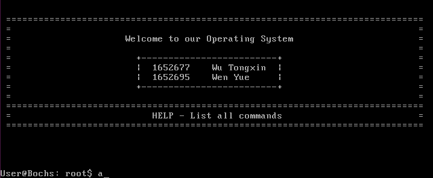

+ Clear：在控制台输入clear，清空控制台内容

  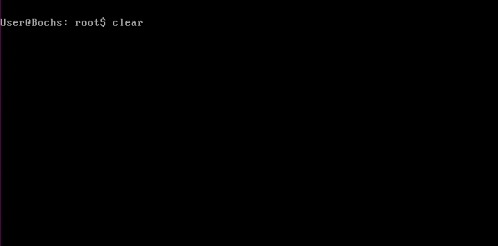

- Help：在控制台输入help，展示当前所有可用指令

  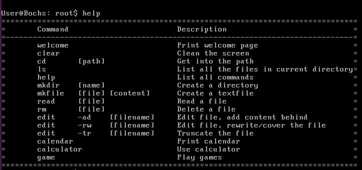

### 文件管理

- Cd：在控制台输入cd [path]指令，可以进入该路径

  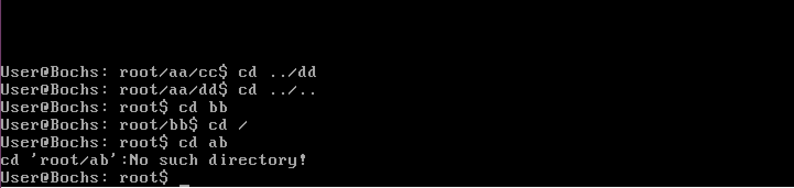

- Ls：在控制台输入ls指令，可以输出当前目录下的所有文件列表

  

- Mkdir：在控制台输入mkdir [name]指令，可以在当前目录下创建新的目录

  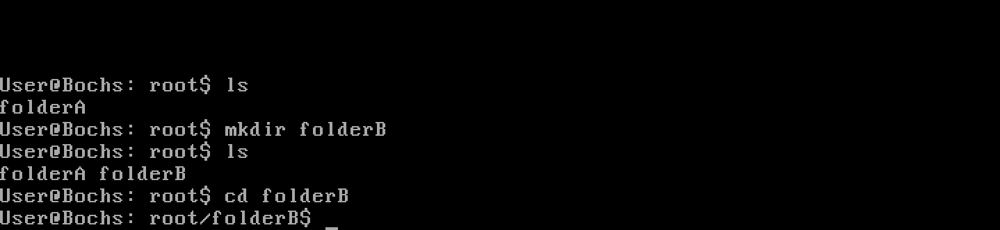

- Mkfile：在控制台输入mkfile [file]\[content]指令，可以在当前目录下创建新的文本文件并输入内容

  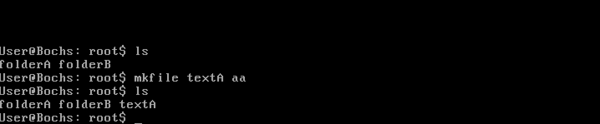

- Read：在控制台输入read [file]指令，可以读取该文件

  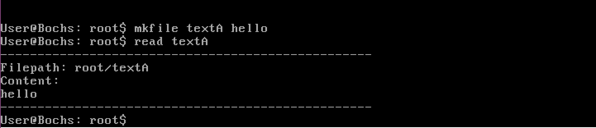

- Rm：在控制台输入rm [file]指令，可以删除该文件

  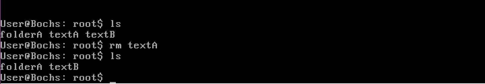

- Edit：1.在控制台输入edit -ad [filename]指令，可以编辑文件，追加文件内容

  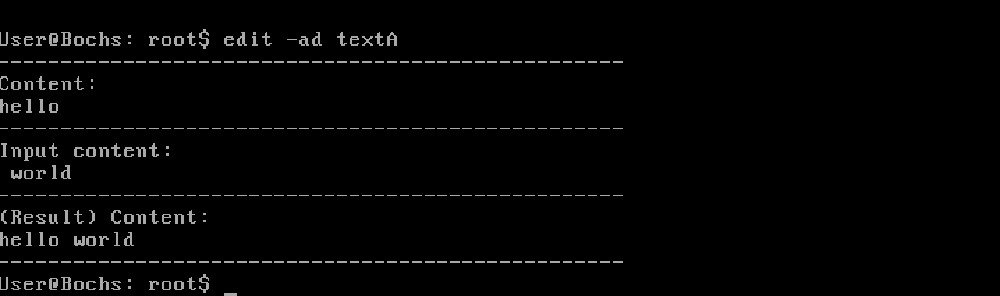

     	   2.在控制台输入edit -rw [filename]指令，可以编辑文件，覆盖文件内容

  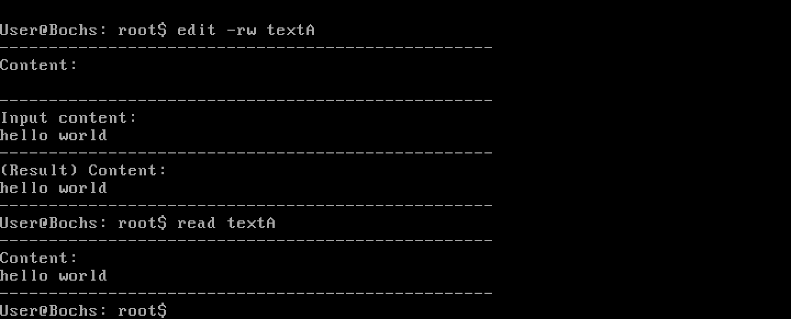

             3.在控制台输入edit -tr [filename]指令，可以截短文件，清空文件内容

  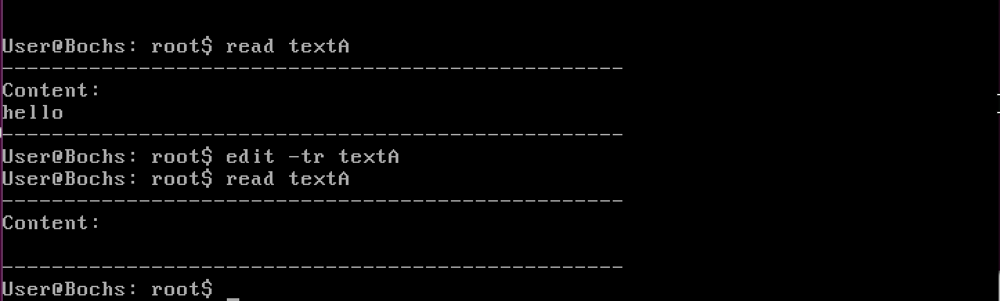

### 应用程序

- Calculator：在控制台输入calculator，进入应用程序“计算器”界面

  该计算器可以实现由两位正整数参与的简单的加减乘除四则运算。

  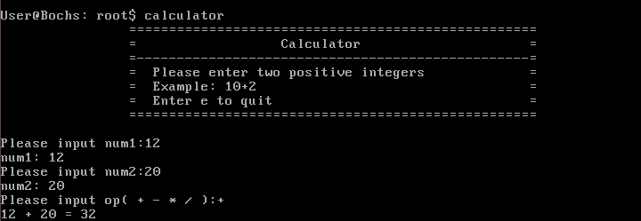

- Calendar：在控制台输入calendar，进入应用程序“日历”界面

  日历可以展示由用户输入的年份月份确定的当月日历。

  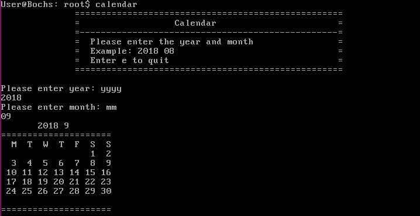

- Game：在控制台输入game，进入应用程序“游戏”界面

  在游戏界面中， 用户可以选择三种不同的简单小游戏进行玩耍。

  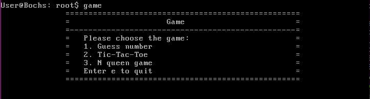

  + 猜数字

    系统设定了一个1至999之间的正整数，用户进行猜数字，会得到过大或者过小的回答。

    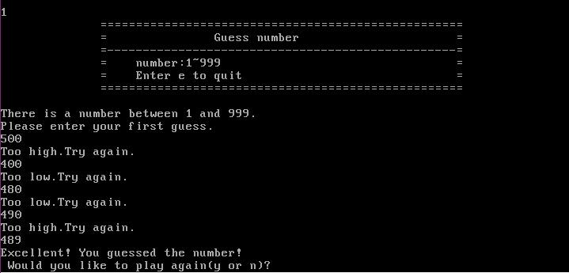

  + 井字棋

    在井字棋游戏中，玩家可以选择自己先手还是计算机先手，通过选择数字1-9来确定自己下棋的位置。玩家下棋以“O”表示，计算机下棋以“X”表示。

    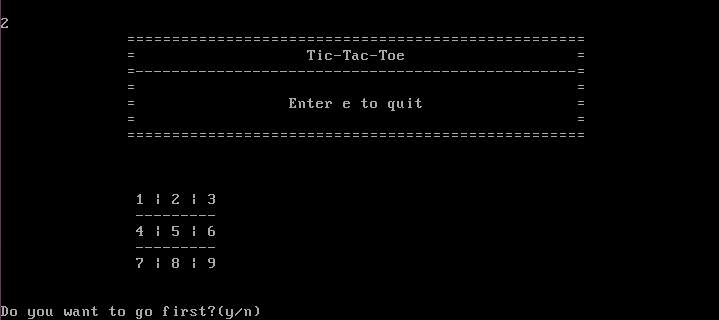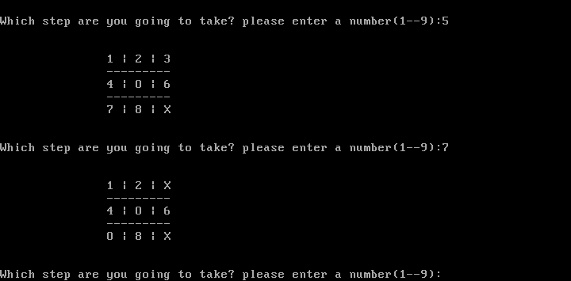

  + N皇后游戏

    对于一个N*N大小的棋盘，放置N个棋子，要求任意两个棋子不能在同一行、同一列或同一斜线上。

    根据玩家指定的N的值，计算机将给出解的个数及每个解的放置方式。

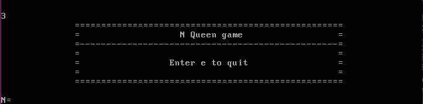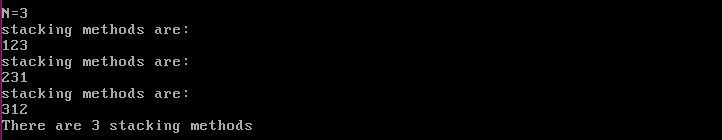

## 部分功能实现流程

### 创建文件

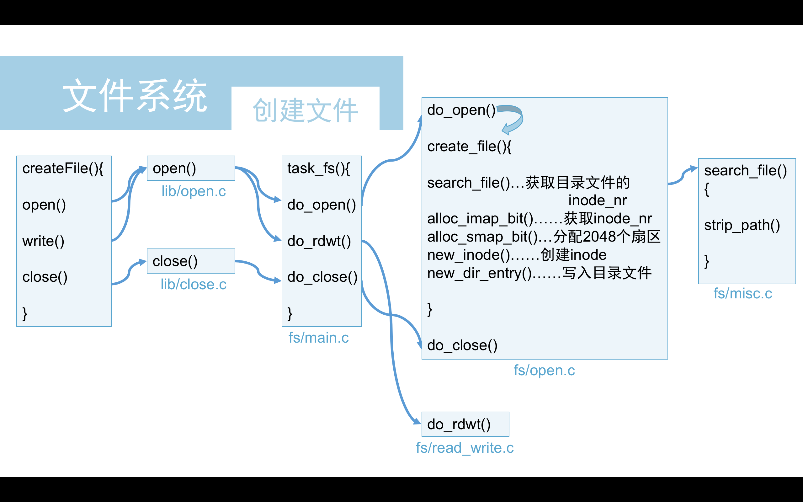

### 创建文件夹

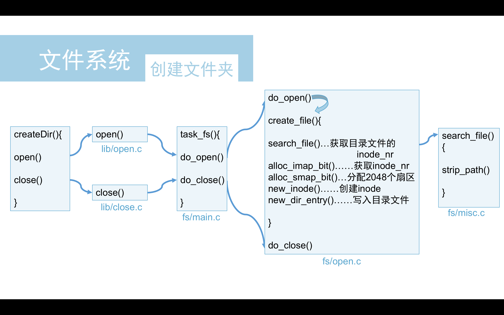

### 删除文件

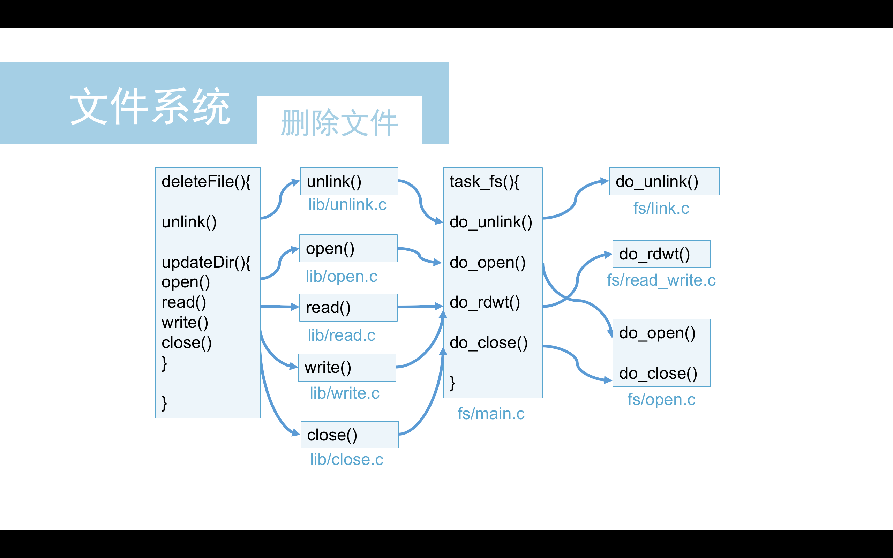

### 删除文件夹

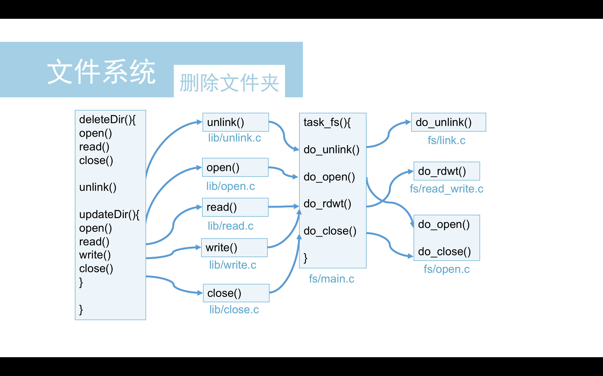

### 应用程序

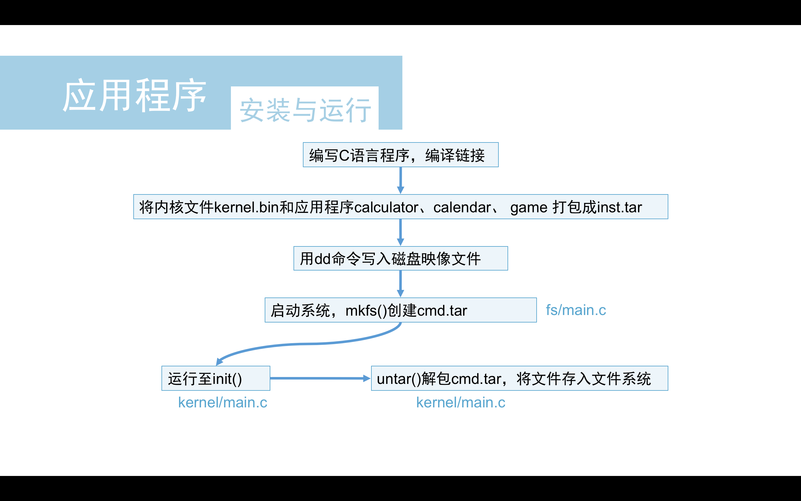
